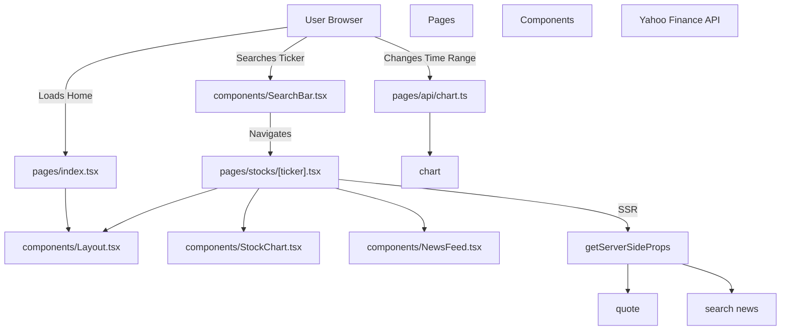
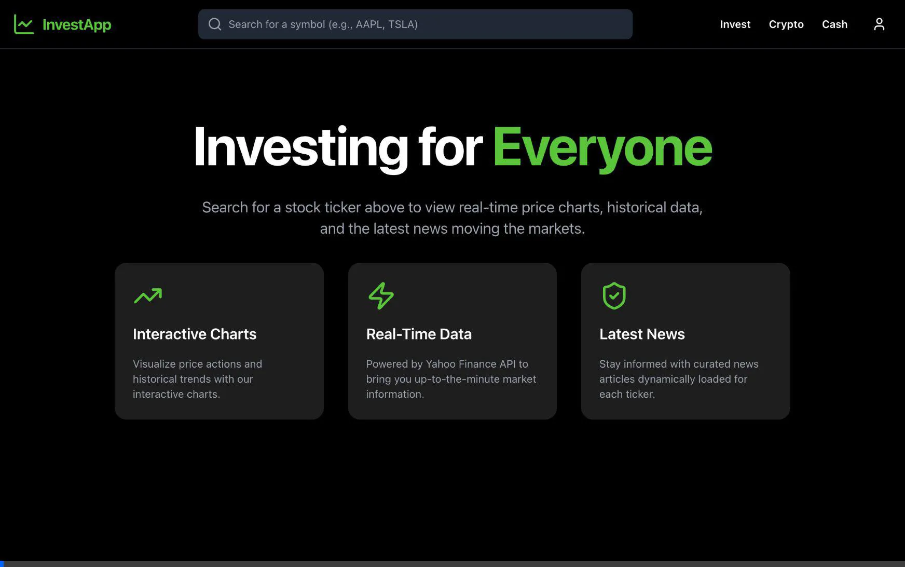
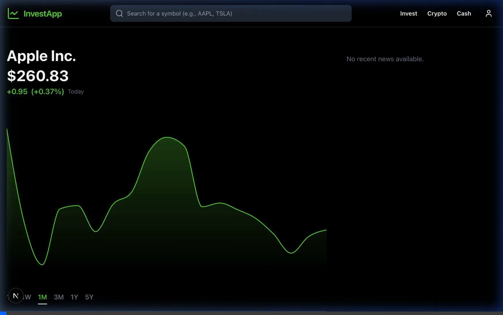

# Antigravity Investment App

A Robinhood-inspired web application for viewing stock information, interactive charts, and latest news. Built using Next.js (Pages Router), Tailwind CSS v3, Recharts, and Yahoo Finance API.

## Architecture



## Getting Started

1. Install dependencies:
```bash
npm install
```

2. Run the development server:
```bash
npm run dev
```

3. Open [http://localhost:3000](http://localhost:3000) with your browser to see the result.

## Built with Antigravity

This application was generated and built from scratch using **Antigravity**, the advanced agentic coding assistant designed by Google Deepmind.

### Process
1. **Planning**: Antigravity engaged in a structured planning phase, outlining tasks and architectural direction (e.g., verifying if the user wanted Pages vs. App router, explicitly defining the dark mode aesthetics, and deciding on Yahoo Finance for the data).
2. **Project Setup**: Automated the setup of a Next.js environment by running shell scripts and configuring the Tailwind v3 setup requested by the user.
3. **Execution**: Crafted custom React components (`Layout`, `NewsFeed`, `StockChart`), wired them together to form the dynamic `/stocks/[ticker]` page, and constructed the server-side API integrations using `yahoo-finance2`.
4. **Autonomous Testing**: Used a robust browser subagent to *autonomously* open Google Chrome, navigate to the localhost app, input search terms, and visually/programmatically verify that the layout and data-loading worked correctly. When Antigravity found a serialization crash with Date objects from the API, it analyzed the stack trace, updated the types/JSON parsers on the server side, and verified the fix worked without human intervention!

### Browser Agent Demos

Here are the actual recordings captured by the Antigravity Browser Agent while it autonomously verified the application functioning:

**1. Generating the Project & Searching**


**2. Verifying the Live Data Dashboard**

